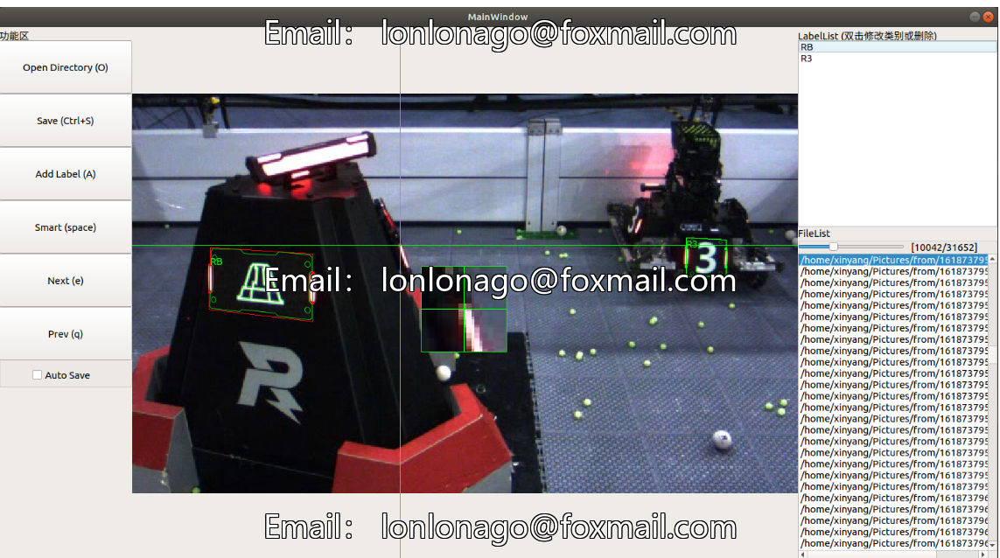

# RoboMaster Intelligent Dataset Annotator C++ Source Code + Linux Compilation and Execution Program

Based on [Qt5+OpenCV (with OpenVINO)], it is used for annotating the positions of four corners of the armor plate of RoboMaster, the color of the light strips, and the type of stickers. The development branch suggests downloading the software and source code from the release.

My first Qt project, please forgive any mistakes I make.

Project Introduction:

The deep learning-based auto-aiming recognition algorithm has gradually entered the arena of RoboMaster competitions. Compared to traditional visual recognition algorithms, deep learning-based algorithms have stronger robustness and adaptability, which have been favored by many teams.

However, conventional deep learning target detection algorithms can only recognize the outer bounding box of the target, which poses difficulties for subsequent algorithms in monocular distance measurement.

This project aims to establish a convenient 4-point dataset annotation tool that can quickly and accurately complete data set production.

Main Features:

Overlaid standard armor plate sticker images onto the pictures for easy observation of the results.
Local magnification during point selection for easier observation of the position of the points.
Intelligent pre-recognition to reduce labor.
(Requires OpenVINO support for OpenCV, but speed will slow down without OpenVINO)
Image scaling and dragging.
Use of OpenVINO for int8 acceleration.
(Not available without OpenVINO)
Support for compiling with cmake.
Compilation method:
mkdir build
cd build
cmake ..
make

Compilation success was achieved on Qt5.15 & Qt5.12, uncertain whether it can be compiled successfully on lower versions of Qt.
Installation method for OpenCV With OpenVINO: official website link, install the OpenVINO SDK package, which comes with OpenCV With OpenVINO.

## Images

Here is a pay link on Stripe ( https://buy.stripe.com/3cs8yP7sY87d0vu9AB ). Please contact me lonlonago@foxmail.com after funding $89, and I will send you a complete data files , thank you!

